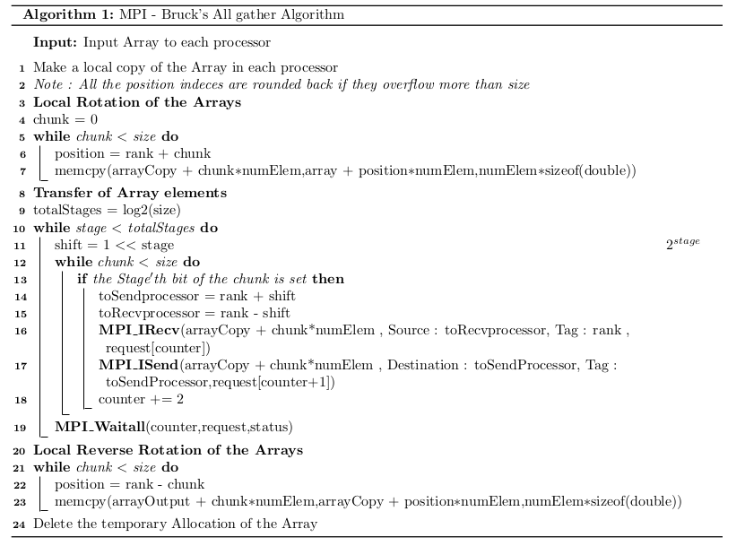
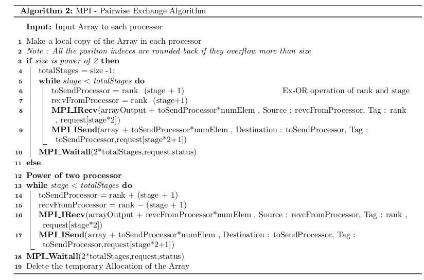

MPI - AlltoAll Collective
=========================

Implement using MPI and compare Bruck's algorithm and pairwise exchange
algorithm for alltoall collective for different message sizes (1K, 2K,
4K, 8K, 16K, 32K, 64K, 128K, 256K, 1M Bytes)

Parallel Methodology
--------------------

for All2All collective , we will be implementing Bruck's Algorithm and
pairwise exchange algorithm . Bruck's algorithm is common algorithm for
all number of processors. However pair wise exchange algorithm has two
variants for power of 2 and non power of two processors

Experimental Setup
------------------

Various Message of 1K, 2K, 4K, 8K, 16K, 32K, 64K, 128K, 256K, 1M Bytes
are transfered using 8, 16, 32, 64 and 96 cores.

1.  To compare the Execution time of various messsage sizes for
    different processor Sizes

2.  To compare execution time of various messages for Bruck's and
    pairwise Exchange algorithm

3.  To compare the efficiency of the implemented algorithm vs the
    standard MPI\_all2all algorithm.

4.  To compare the efficiency of the the implemented algorithm vs the
    standard MPI\_all2all algorithm using *Intel® Trace Analyzer and
    Collector Software*

All the Timings for parallel execution was obtained using MPI\_WTime().
All the readings are taken as average of five sperate readings. All the
reasults are valided with standard native MPI\_all2all function.

The Following are the Specifications of the hardware and the compiler
used to perform the experiments

  S.No   Item              Description
  ------ ----------------- -------------------------------------------
  1      Processor         8-core AMD Opteron 3380 processor@ 2.6GHz
  2      RAM               32GB RAM
  3      Number of Cores   80

Results
-------

### Time taken by Pairwise Algorithm for various Message sizes

### Time taken by Brucks Algorithm for various Message sizes

### Comparision of Implemented Pairwise and Brucks - Processor 8 for various message sizes

### Comparision of Pairwise and Brucks - Processor 32 for various message sizes

### Comparision of Pairwise and Brucks - Processor 88 for various message sizes

### Intel MPI - Trace Analysis

The Trace Analysis was performed using Intel® Trace Analyzer and
Collector Software. This will enable us to visualise the MPI process
esspecially in communication process between the processors.\
The red Color in the Figure refers to any of the MPI communication
operation like MPI\_Isend , MPI\_Barrier , MPI\_All2all etc. the blue
color refers to the other user defined instructions that is executed .
So for our communication algorithm, we should have our time line
occupied by more of the communication part (Red) rather than the user
execution part (Blue).

### Standard MPI vs Implemented MPI for smaller message sizes  

### Standard MPI vs Implemented MPI for larger message sizes  

Note : The trace analysis was performed on Tesla System in CMG ( CDS-
IISc ). The specifications of the system are given below

| **S.No** | **Item**          | **Description**                          |
|----------|-------------------|------------------------------------------|
| 1        | Processor         | Intel(R) Xeon(R) Gold 6150 CPU @ 2.70GHz |
| 2        | RAM               | 160 GB                                   |
| 3        | Number of Cores   | 18                                       |
| 4        | NUmber of Threads | 36                                       |
| 5        | Base Frequency    | 3.70 GHz                                 |
| 6        | L3 Cache          | 25 MB                                    |

Observation
-----------

-   As mentioned in the literature ( Thakur et al.) for smaller message
    sizes the brucks algorithm performs better

-   For larger message sizes greater than 16K bytes , the pairwise
    algorithm performs better

-   for non power of 2 processors also , the pairwise algorithm performs
    better for higher message sizes, where as brucks algorithm performs
    better for smaller message sizes.
