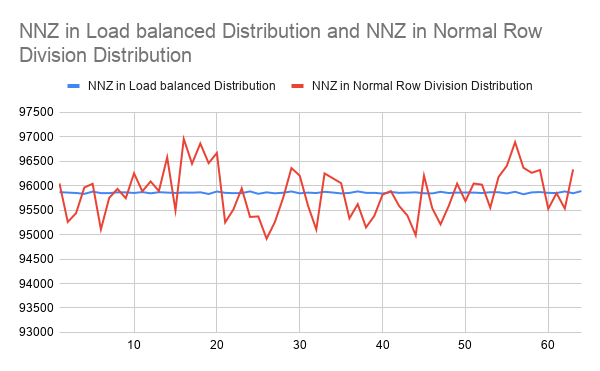
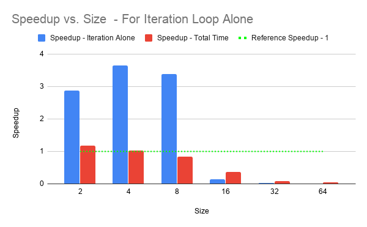
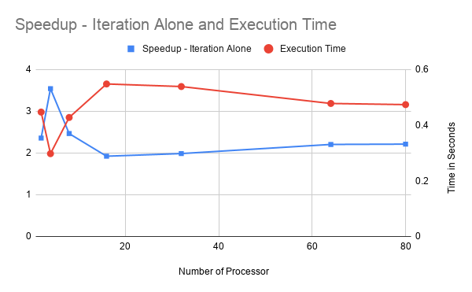
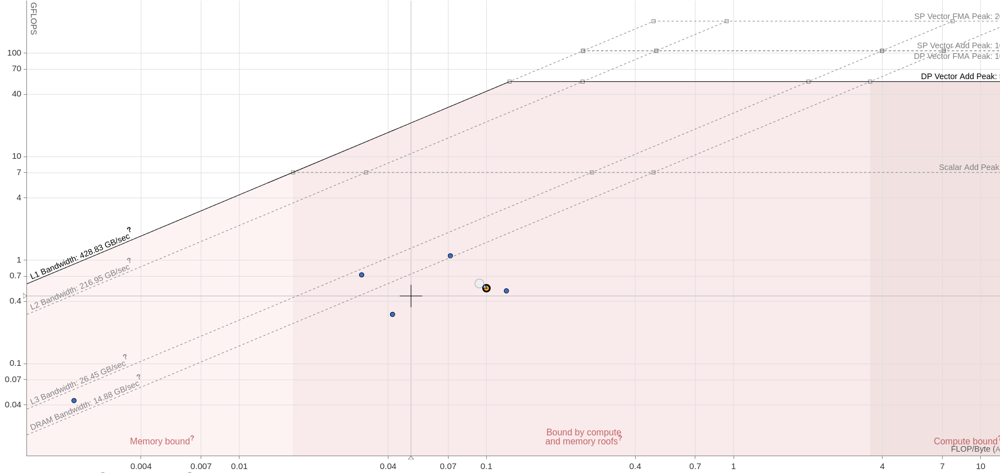
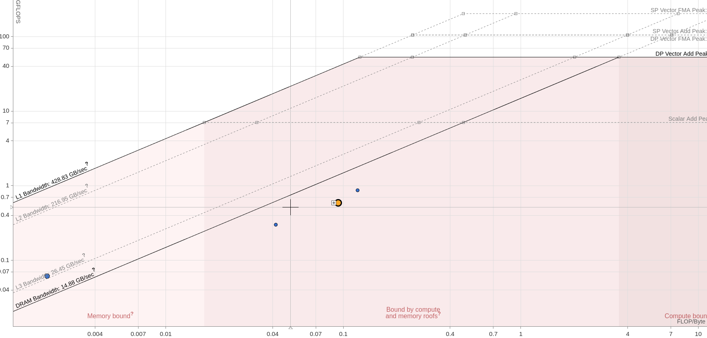

# MPI - Page Rank
===============

Implement a MPI version of the PageRank algorithm. Implement on the
turing cluster and show results on 8, 16, 32, 64 and 128 cores.Report
the total execution times and speedups when compared to a sequential
execution. Give a report on the method, results and observations. and
10.

Parallel Methodology
--------------------

The Parallel algorithm using MPI, we use processor 1 to read the matrix
from the input file. The Matrix is read and stored as \"Compressed
Sparse Row\" Matrix format since the input data Contains lots of Non
Zero Elements.

Experimental Setup
------------------

An standard directed graph of 262144 vertices and 6134949 edges was
used.

-   To compute the Execution Time of Sequential Page Rank

-   To compute the Execution time of Parallel Page Rank for various
    processor Sizes

All the Timings for the sequential are obtained using the function
clock\_gettime() and for parallel it was obtained using MPI\_WTime().
And all the readings are taken as average of five sperate readings.

The Following are the Specifications of the hardware and the compiler
used to perform the experiments

  S.No   Item              Description
  ------ ----------------- -------------------------------------------
  1      Processor         8-core AMD Opteron 3380 processor@ 2.6GHz
  2      RAM               32GB RAM
  3      Number of Cores   80

### Load Balancing across processors

Being a Sparse Matrix of Web Graph,splitting data to each processor
based on the Number of nodes will not be balanced effectively because
some of the vertices might not exist which might or some vertices may
have more NNZ than others ,which might cause the imbalance of load to
all processors. Instead we have distributed based on the Number of
NonZero Values in each processor.

Results
-------

### SpeedUp Graph for Parallel Page Rank - For Graph(1) - 50,000 Vertices

### SpeedUp Graph for Parallel Page Rank - For Graph(1) - 262144 Vertices

### Roofline Analysis

The Roofline analysis was performed using Intel advisor software and the
results are obtained. The analysis was done when run on 1 node and 4
processors. The results for processor zero and 1 are provided in below.

  S.No   Rank   Parameter              Value
  ------ ------ ---------------------- ----------------
  1      0      FLOPS                  0.45
  2      0      Arithmetic Intensity   0.05 FLOP/BYTE
  3      1      FLOPS                  0.51
  4      1      Arithmetic Intensity   0.05 FLOP/BYTE

The Major time consuming part in processors other than the root
processor is the sparse matrix vector vector multiplication. Though the
loop performed achieved an arithmetic intensity of 0.1 FLOP/BYTE, the
performance can be further improved by using sparse BLAS routines for
sparse system.

Note : The Roofline analysis was performed on Tesla System in CMG. The
specifications of the system are given below

  S.No   Item                Description
  ------ ------------------- ------------------------------------------
  1      Processor           Intel(R) Xeon(R) Gold 6150 CPU @ 2.70GHz
  2      RAM                 160 GB
  3      Number of Cores     18
  4      NUmber of Threads   36
  5      Base Frequency      3.70 GHz
  6      L3 Cache            25 MB

Results
-------

-   The Speed up was observed good (greater than 2) for all the
    processors however the scalability of the code was not increasing.

-   This Might be due to the fact that the variation in execution times
    between iterations in Turing was in the range of 0.1 to 0.15
    seconds, which was the range within which we were getting the
    speedup times.
